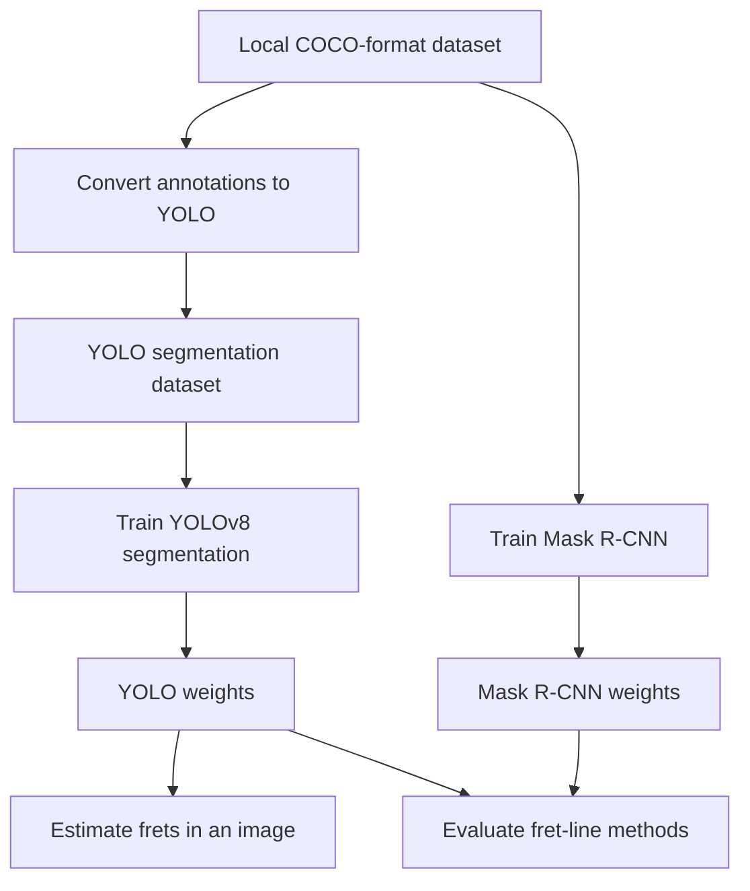

# Guitar CV AMT

This repo contains the ongoing computer-vision work from the [AIM Lab](https://ai4musicians.org/) automatic music transcription group. The repository contains building blocks for finding a guitar fretboard in an image or video, turning it into a consistent top-down view, estimating fret positions, and exploring hand-motion and chord-candidate ideas.

Most of the work here is still a WIP.

## What is here

| Goal | Existing implementation |
| --- | --- |
| Find a fretboard | Mask R-CNN and YOLOv8 segmentation training and inference workflows |
| Estimate fret positions | Geometric PCA + perspective-warp method that projects 21 expected fret lines from a fretboard mask |
| Compare approaches | Evaluation of Mask R-CNN and optional YOLO masks across six fret-line methods |
| Explore related ideas | Canonicalization, FFT chord-candidate, webcam hand-tracking, and strum/pick demos |

The active script workflow is grouped in [`pipeline/`](pipeline/). Exploratory work, demos, published notebooks, and frozen experiments remain separate from it.

## Quick start: estimate frets in one image

1. Install the [Git LFS](https://git-lfs.com/) command-line tool before cloning when possible. If the repository is already cloned, the `git lfs install` and `git lfs pull` commands below fetch the bundled checkpoints.
2. Create a Python environment and install the project dependencies:

   ```bash
   python -m venv .venv
   ```

   **Windows PowerShell:**

   ```powershell
   .\.venv\Scripts\Activate.ps1
   ```

   **macOS/Linux:**

   ```bash
   source .venv/bin/activate
   ```

   ```bash
   python -m pip install --upgrade pip
   python -m pip install -r requirements.txt
   git lfs install
   git lfs pull
   ```

   The active segmentation scripts use PyTorch. If the `torch` installation needs CUDA or another accelerator-specific build, install the appropriate version from [PyTorch](https://pytorch.org/get-started/locally/) first, then install the remaining requirements.

3. Run the existing YOLO model on a guitar image:

   ```bash
   python pipeline/fret_detect_yolo.py \
     --image path/to/guitar.jpg \
     --visualize \
     --output result.png
   ```

   This command uses `pipeline/yolo_weights_best.pt` by default. It draws the inferred fretboard mask and estimated fret lines on `result.png`.

## Active pipeline



### 1. Provide the dataset

The repository does not contain training data. The active scripts expect a local COCO-style dataset at `pipeline/dataset/`:

```text
pipeline/dataset/
├── train/
│   ├── _annotations.coco.json
│   └── image files
├── valid/
│   ├── _annotations.coco.json
│   └── image files
└── test/                         # optional for conversion; used when evaluating
    ├── _annotations.coco.json
    └── image files
```

The local dataset, converted YOLO dataset, and YOLO training-run directory are intentionally ignored by Git. The COCO annotations need image names, polygon segmentations, and bounding boxes for the configured fret/fret-zone categories.

### 2. Prepare and train a segmentation model

**YOLOv8 path** — convert the COCO annotations, then train:

```bash
python pipeline/convert_coco_to_yolo.py
python pipeline/train_yolo.py
```

- Conversion creates `pipeline/dataset_yolo/`, removes any previous version of that directory, and makes symlinks to the source images. On Windows, symlink creation may require Developer Mode or elevated permissions.
- YOLO training reads `pipeline/dataset_yolo/dataset.yaml`, writes run files to `pipeline/yolo_runs/`, and copies the selected model to `pipeline/yolo_weights_best.pt`.
- Optional training controls are available, for example:

  ```bash
  python pipeline/train_yolo.py --model yolov8s-seg --epochs 100 --imgsz 640 --batch 8
  ```

**Mask R-CNN path** — train directly from the COCO dataset:

```bash
python pipeline/train_mask.py
```

This writes `pipeline/model_weights_new.pt`. The existing `pipeline/model_weights.pt` is the default Mask R-CNN checkpoint used by the evaluator; do not use either Mask R-CNN file with the YOLO scripts.

### 3. Estimate frets from an image

[`pipeline/fret_detect_yolo.py`](pipeline/fret_detect_yolo.py) first predicts a fretboard segmentation mask. It then cleans that mask, estimates the fretboard corners with PCA, warps the board to a standard rectangle, and uses the Rule of 18 to project up to 21 fret positions back onto the original image.

This is a geometry-based estimate from the fretboard mask. It does **not** independently detect every physical fret wire in the image.

```bash
python pipeline/fret_detect_yolo.py \
  --image path/to/guitar.jpg \
  --weights pipeline/yolo_weights_best.pt \
  --visualize --output result.png
```

### 4. Evaluate the approaches

[`pipeline/evaluate_all.py`](pipeline/evaluate_all.py) measures segmentation quality and runs six fret-line estimation methods on the available `valid` and `test` splits. It always evaluates a Mask R-CNN checkpoint and can optionally evaluate YOLO as well:

```bash
python pipeline/evaluate_all.py \
  --weights pipeline/model_weights_new.pt \
  --yolo-weights pipeline/yolo_weights_best.pt
```

The command overwrites `pipeline/evaluation_results.csv` with the latest results.

## Pipeline workspace

All path-dependent production files are intentionally co-located in [`pipeline/`](pipeline/) so their existing sibling-relative data, model, and output paths continue to work without source-code changes.

| Stage | Files | Purpose |
| --- | --- | --- |
| Data preparation | `convert_coco_to_yolo.py` | Converts annotated COCO splits into a one-class YOLO segmentation dataset |
| Training | `train_yolo.py`, `train_mask.py` | Trains YOLOv8 segmentation or Mask R-CNN from the local dataset |
| Inference | `fret_detect_yolo.py` | Segments a guitar fretboard and estimates fret positions in one image |
| Evaluation | `evaluate_all.py`, `evaluation_results.csv` | Compares models and fret-line methods, then records metrics |
| Model artifacts | `yolo_weights_best.pt`, `model_weights.pt`, `model_weights_new.pt` | Checkpoints tied to their respective YOLO or Mask R-CNN workflows |
| Recorded analysis | `yolo_comparison_results.md` | Summary of the stored Mask R-CNN versus YOLO experiment |

## Other parts of the repository

| Location | Contents | When to use it |
| --- | --- | --- |
| [`notebooks/`](notebooks/) | Canonicalization, FFT chord-candidate, and template notebooks | Explore experiments interactively |
| [`demos/fretboard_canonicalization/`](demos/fretboard_canonicalization/) | A dedicated canonicalization notebook, environment file, model, and Hough video demo | Run the standalone canonicalization experiment |
| [`scripts/`](scripts/) | Webcam hand-landmark and guitar/strum-pick demos | Try live, camera-based experiments; a webcam and optional local model downloads may be required |
| [`docs/`](docs/) | Generated JupyterLite/Voici static demo site | Browse the published interactive notebook output |
| [`binder/`](binder/) | Binder-specific setup and dependencies | Build the hosted notebook environment |
| [`deprecated/`](deprecated/) | Frozen legacy experiments | Reference only; not part of the active workflow |
| `Untitled0.ipynb` | Empty historical Colab stub | Not part of the supported workflow |

### Interactive notebooks

- [Canonical fretboard notebook](notebooks/canonical_fretboard.ipynb)
- [FFT chord-candidate notebook](notebooks/fft_chord_candidates.ipynb)
- [Published canonicalization demo](docs/voici/render/canonical_fretboard.html)
- [Published FFT chord-candidate demo](docs/voici/render/fft_chord_candidates.html)

The notebook and webcam demos are exploratory tools, not a complete chord-recognition or transcription system.

## Existing experiment results

The stored [YOLO vs. Mask R-CNN comparison](pipeline/yolo_comparison_results.md) and [detailed CSV metrics](pipeline/evaluation_results.csv) record results from one local experiment. They are useful for understanding the tested models and fret-line methods, but should not be treated as a general performance guarantee because the dataset, hardware, and broader evaluation protocol are not distributed here.

## New Members

For the research context behind fretboard, fingertip, string, and pressed-versus-hovering-finger detection, see:

- [Duke & Salgian (2019)](https://doi.org/10.1007/978-3-030-33723-0_20) — Purdue access may be required; the paper begins on page 248 (PDF page 267).
- [Asmar (2022)](https://publications.polymtl.ca/10470/1/2022_MarkAsmar.pdf)
- [Ghaleb et al. (2024)](https://arxiv.org/abs/2409.08618)
